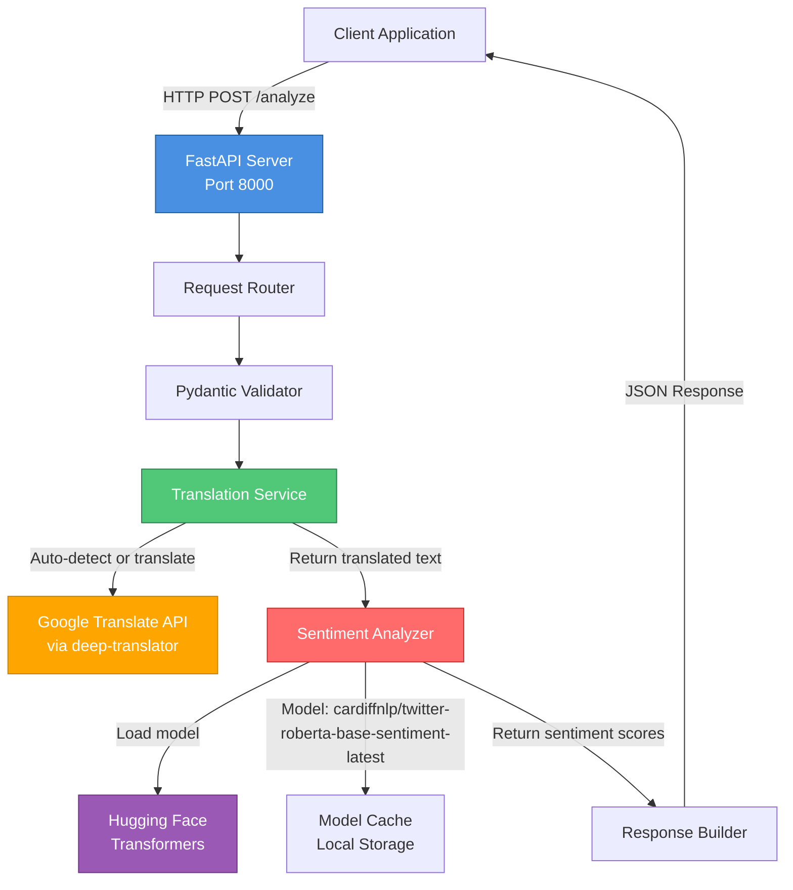
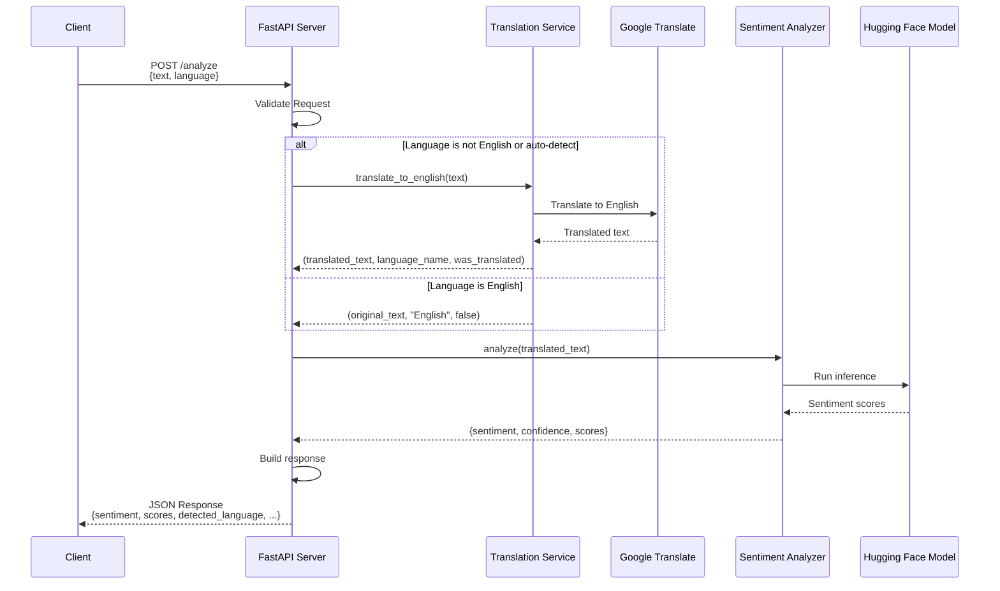
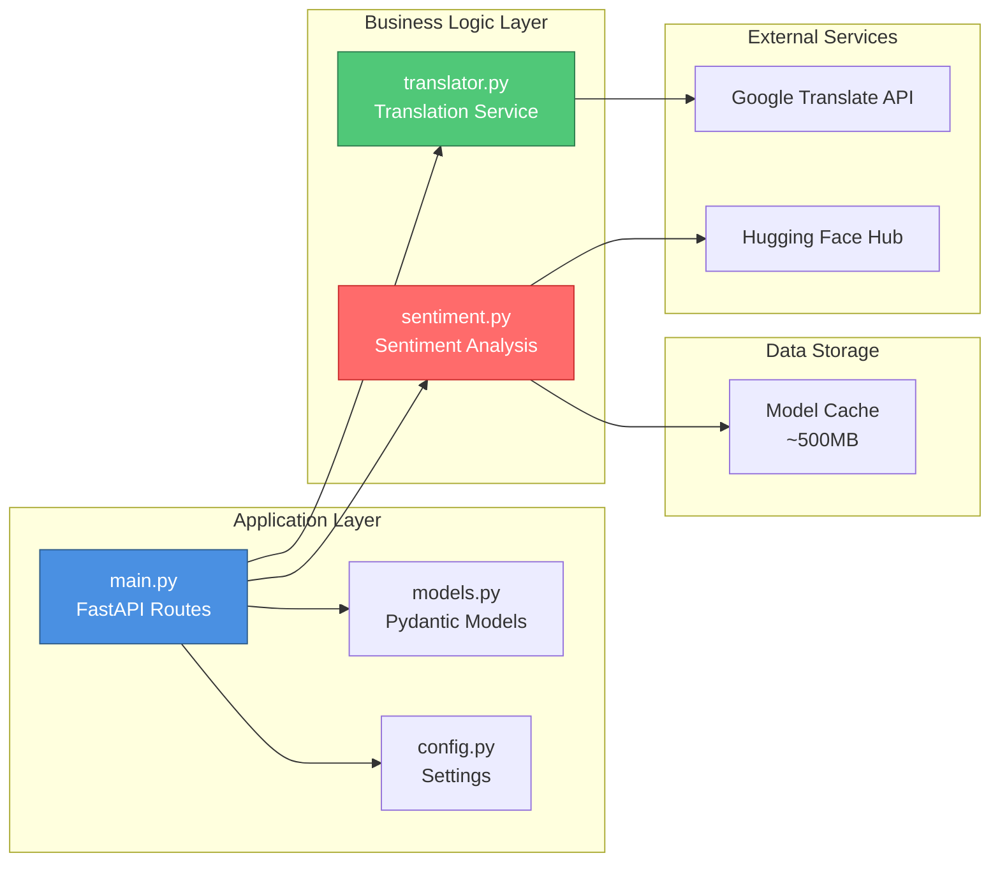
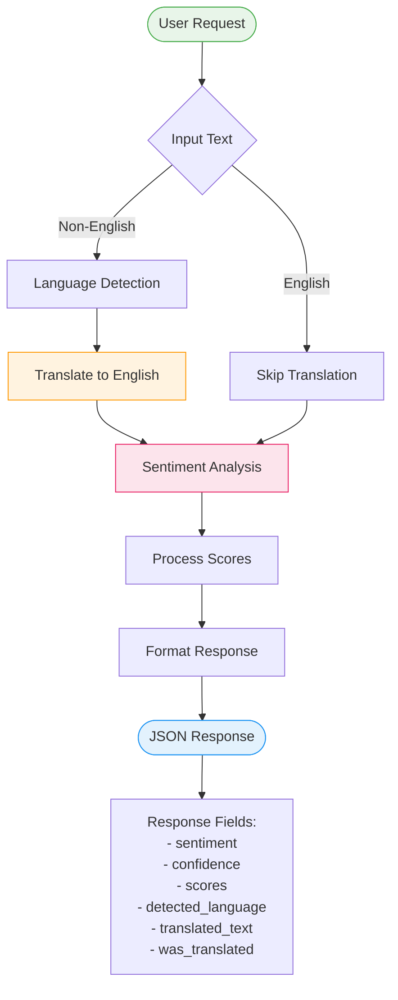
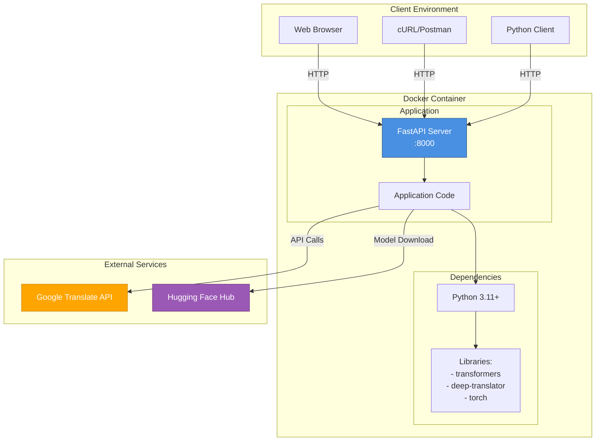
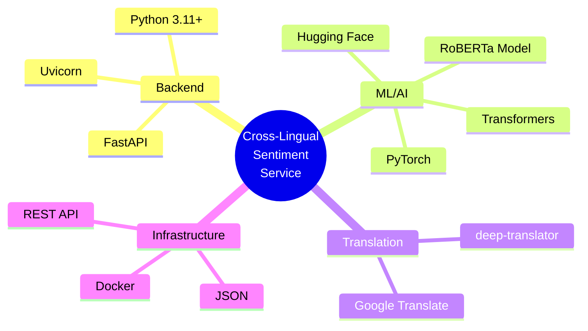

# System Architecture

## Architecture Diagram

```mermaid
graph TB
    Client[Client Application] -->|HTTP POST /analyze| API[FastAPI Server<br/>Port 8000]
    
    API --> Router[Request Router]
    Router --> Validator[Pydantic Validator]
    Validator --> Translator[Translation Service]
    
    Translator -->|Auto-detect or translate| GoogleTranslate[Google Translate API<br/>via deep-translator]
    Translator -->|Return translated text| SentimentAnalyzer[Sentiment Analyzer]
    
    SentimentAnalyzer -->|Load model| HuggingFace[Hugging Face<br/>Transformers]
    SentimentAnalyzer -->|Model: cardiffnlp/twitter-roberta-base-sentiment-latest| ModelCache[Model Cache<br/>Local Storage]
    
    SentimentAnalyzer -->|Return sentiment scores| ResponseBuilder[Response Builder]
    ResponseBuilder -->|JSON Response| Client
    
    style API fill:#4A90E2,stroke:#2E5C8A,color:#fff
    style Translator fill:#50C878,stroke:#2E7D4E,color:#fff
    style SentimentAnalyzer fill:#FF6B6B,stroke:#C92A2A,color:#fff
    style GoogleTranslate fill:#FFA500,stroke:#CC8400,color:#fff
    style HuggingFace fill:#9B59B6,stroke:#6C3483,color:#fff
```

## System Flow Diagram

```mermaid
sequenceDiagram
    participant Client
    participant FastAPI as FastAPI Server
    participant Translator as Translation Service
    participant Google as Google Translate
    participant Sentiment as Sentiment Analyzer
    participant Model as Hugging Face Model
    
    Client->>FastAPI: POST /analyze<br/>{text, language}
    FastAPI->>FastAPI: Validate Request
    
    alt Language is not English or auto-detect
        FastAPI->>Translator: translate_to_english(text)
        Translator->>Google: Translate to English
        Google-->>Translator: Translated text
        Translator-->>FastAPI: (translated_text, language_name, was_translated)
    else Language is English
        Translator-->>FastAPI: (original_text, "English", false)
    end
    
    FastAPI->>Sentiment: analyze(translated_text)
    Sentiment->>Model: Run inference
    Model-->>Sentiment: Sentiment scores
    Sentiment-->>FastAPI: {sentiment, confidence, scores}
    
    FastAPI->>FastAPI: Build response
    FastAPI-->>Client: JSON Response<br/>{sentiment, scores, detected_language, ...}
```

## Component Architecture

```mermaid
graph LR
    subgraph "Application Layer"
        Main[main.py<br/>FastAPI Routes]
        Models[models.py<br/>Pydantic Models]
        Config[config.py<br/>Settings]
    end
    
    subgraph "Business Logic Layer"
        Translator[translator.py<br/>Translation Service]
        Sentiment[sentiment.py<br/>Sentiment Analysis]
    end
    
    subgraph "External Services"
        GoogleAPI[Google Translate API]
        HuggingFaceAPI[Hugging Face Hub]
    end
    
    subgraph "Data Storage"
        ModelCache[Model Cache<br/>~500MB]
    end
    
    Main --> Models
    Main --> Config
    Main --> Translator
    Main --> Sentiment
    
    Translator --> GoogleAPI
    Sentiment --> HuggingFaceAPI
    Sentiment --> ModelCache
    
    style Main fill:#4A90E2,stroke:#2E5C8A,color:#fff
    style Translator fill:#50C878,stroke:#2E7D4E,color:#fff
    style Sentiment fill:#FF6B6B,stroke:#C92A2A,color:#fff
```

## Data Flow

```mermaid
flowchart TD
    Start([User Request]) --> Input{Input Text}
    Input -->|Non-English| Detect[Language Detection]
    Input -->|English| SkipTranslate[Skip Translation]
    
    Detect --> Translate[Translate to English]
    Translate --> SentimentAnalysis[Sentiment Analysis]
    SkipTranslate --> SentimentAnalysis
    
    SentimentAnalysis --> Process[Process Scores]
    Process --> Format[Format Response]
    Format --> Output([JSON Response])
    
    Output --> Fields[Response Fields:<br/>- sentiment<br/>- confidence<br/>- scores<br/>- detected_language<br/>- translated_text<br/>- was_translated]
    
    style Start fill:#E8F5E9,stroke:#4CAF50
    style Output fill:#E3F2FD,stroke:#2196F3
    style Translate fill:#FFF3E0,stroke:#FF9800
    style SentimentAnalysis fill:#FCE4EC,stroke:#E91E63
```

## Deployment Architecture

```mermaid
graph TB
    subgraph "Client Environment"
        Browser[Web Browser]
        CLI[cURL/Postman]
        Python[Python Client]
    end
    
    subgraph "Docker Container"
        subgraph "Application"
            FastAPI[FastAPI Server<br/>:8000]
            AppCode[Application Code]
        end
        
        subgraph "Dependencies"
            PythonEnv[Python 3.11+]
            Libs[Libraries:<br/>- transformers<br/>- deep-translator<br/>- torch]
        end
    end
    
    subgraph "External Services"
        GoogleTranslate[Google Translate API]
        HuggingFace[Hugging Face Hub]
    end
    
    Browser -->|HTTP| FastAPI
    CLI -->|HTTP| FastAPI
    Python -->|HTTP| FastAPI
    
    FastAPI --> AppCode
    AppCode --> PythonEnv
    PythonEnv --> Libs
    
    AppCode -->|API Calls| GoogleTranslate
    AppCode -->|Model Download| HuggingFace
    
    style FastAPI fill:#4A90E2,stroke:#2E5C8A,color:#fff
    style GoogleTranslate fill:#FFA500,stroke:#CC8400,color:#fff
    style HuggingFace fill:#9B59B6,stroke:#6C3483,color:#fff
```

## Technology Stack

```mermaid
mindmap
  root((Cross-Lingual<br/>Sentiment<br/>Service))
    Backend
      FastAPI
      Python 3.11+
      Uvicorn
    ML/AI
      Hugging Face
      Transformers
      RoBERTa Model
      PyTorch
    Translation
      deep-translator
      Google Translate
    Infrastructure
      Docker
      REST API
      JSON
```

